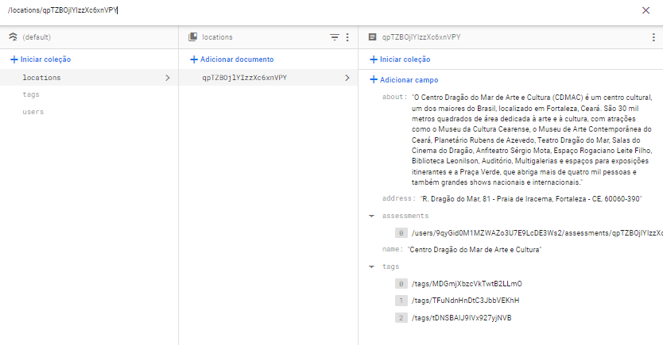
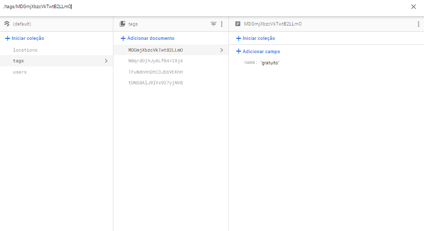
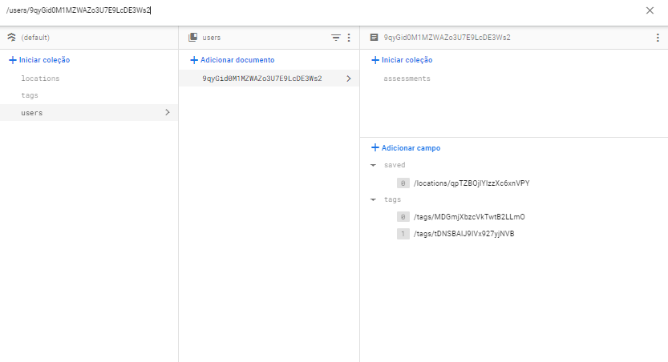
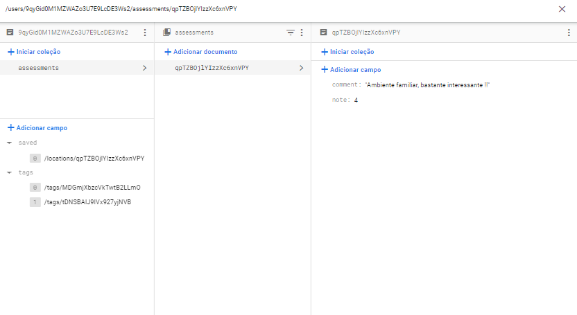

# Firebase Firestore

## Lista de coleções

- [locations](#coleção-locations)
- [tags](#coleção-tags)
- [users](#coleção-users)

## Coleção **locations**

Consiste em um agrupamento de documentos firebase referente aos dados dos locais, de modo que cada um possua um ID aleatório e armazene os dados com os seguinte atributos:

| Atributo    | Tipo   | Sobre |  
| ------------| ------ | ----- |
| name        | String | Nome do local.                       
| about       | String | Pequena descrição atrativa do lugar. 
| address     | String | Endereço do ambiente.      
| tags        | Array  | Lista de referências firebase, de maneira que cada valor de índice/item/referência aponte para um documento de tag pertencente à coleção de `tags`
| assessments | Array  | Lista de referências firebase, de maneira que cada valor de índice/item/referência aponte para um documento de avaliação do local pertencente à coleção de `assessments` dos usuários que classificaram.

## Coleção **tags**

Consiste em um agrupamento de documentos firebase referente dados dados das tags, de modo que cada um possua um ID aleatório e armazene os dados com os seguinte atributos::

| Atributo    | Tipo   | Sobre |  
| ------------| ------ | ----- |
| name        | String | Nome identificador da tag (gratuito, cultura, pago, arte, etc).

## Coleção **users**

Consiste em um agrupamento de documentos firebase referente aos dados dos usuários, de modo que cada um possua como ID o mesmo ID do firebase authentication e armazene os dados com os seguinte atributos:

| Atributo    | Tipo   | Sobre |  
| ------------| ------ | ----- |
| saved       | Array  | Lista de referências firebase, de maneira que cada valor de índice/item/referência aponte para um documento de localização pertencente à coleção de `locations`
| tags        | Array  | Lista de referências firebase, de maneira que cada valor de índice/item/referência aponte para um documento de tag pertencente à coleção de `tags`

Ademais, possui também uma coleção interna contendo todas as avaliações do usuário denominada de `assessments`, de modo que cada documento possua como ID o mesmo ID do local referente e armazene os dados com os seguinte atributos:

| Atributo    | Tipo   | Sobre |  
| ------------| ------ | ----- |
| comment     | String | Opinião do usuário a respeito do local em formato de comentário. 
| note        | Number | Avaliação em uma única nota pertencente ao conjunto dos inteiros de 1 a 5.

# Firebase Authentication

Ainda em desenvolvimento...
